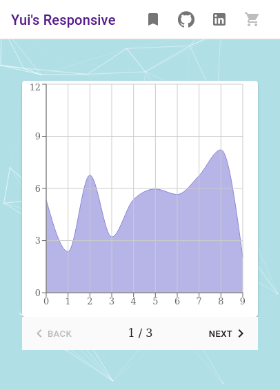

# Yui's Responsive 

Website: [https://zcemycl.github.io/practice-app/](https://zcemycl.github.io/practice-app/)

### Functionalities 
- Backend connection
  - Real time data graph
  - Connected to REST API from https://github.com/zcemycl/flask2react
- Authentication
  - Username: IamLeo 
  - Password: IamLeo  
- Chatapp
  - Support real-time messaging
  - Not support conversation history
- 3D Scene
  - Three Fiber, drei, Blender
- Like and Comment Section
  - Like -- Lyket
  - Comment -- Ably
- 3D City Map
  - OpenStreetMap and Blender
- Image Annotation
  - rough -- draw, drag, resize and delete
  - Maybe connect to S3 for data synchronization
- Feedback Form [To-do]
- Try D3 force, cytoscapejs, react-diagram, drag and drop, etc.
- Need to use more lifecycle.
- Newsletter Subscription [To-do]
- Online shop [In Progress]

