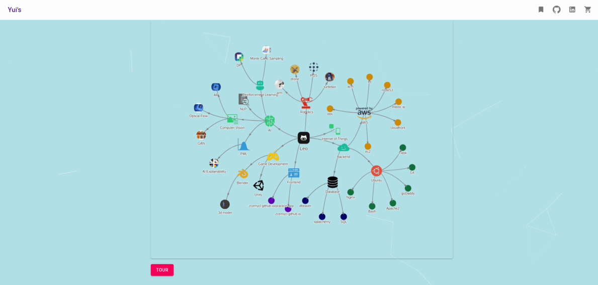

# Yui's Responsive [](https://opensource.org/licenses/MIT)  [](https://coveralls.io/github/zcemycl/practice-app?branch=master) [](https://hits.seeyoufarm.com)

Website: [https://zcemycl.github.io/practice-app/](https://zcemycl.github.io/practice-app/)



### How to Start?
```
git clone https://github.com/zcemycl/practice-app.git
npm install
touch .env # edit api keys
npm start
```

### Functionalities 
|Features|Locations|Description|
|--|--|--|
|Backend Support|[flask2react](https://github.com/zcemycl/flask2react)|Support chatapp socket, fetch non-dynamic and dynamic data. |
|Unit Tests|[Link](.github/workflows/main.yml)|Continuous Integration Practices with Github Actions.|
|Router|[Link](src/LoadBalancer.jsx)|Enable access to different pages.|
|Single Page Application|[Link](public)|Enable resources suffix.|
|Particle Background|[Link](src/config)|Website animated background.|
|Navigation Bar|[Link](src/components/Navbar)|Link the home page to different demos and profiles.|
|Slider Graph|[Link](src/components/ProGraph/UIPlot)|Update datapoint dynamically via slider control.|
|Fetch Data Graph|[Link](src/components/ProGraph/FetchPlot)|Fetch JSON data via REST API from flask2react.|
|Real-time Data Graph|[Link](src/components/ProGraph/SocketPlot)|Fetch Real-time randomly generated data from flask2react|
|Authentication|[Link](src/components/Auth)|GitHub Secret Key as authenication method.  - Username, Password: IamLeo |
|Gallery|[Link](src/components/Random)|Interactive Image Gallery with Spring.|
|Chatapp|[Link](src/components/Chatapp)|Support real-time text communication.|
|Image Annotation for object segmentation|[Link](src/components/Annotate)|`cd resources` -> `pip install -r requirements.txt` -> `python readAnnotate.py [--img str] [--annotatefile str]` |
|Google Map and Projections|[Link](src/components/ClusterMap)|Mark Outcodes and Areas of United Kingdoms.|
|3D Scene|[Link](src/components/ThreeFiber)|3D Models with Physics Simulation, and GUI to control Camera and Player Properties.|
|3D City Map|[Link](src/components/Map)|Map with 3D Building Projections.|
|Like and Comment Section|[Link](src/components/CommentLike)|Provide supports for like, votes, clap and comments for the page.|
|Knowledge Graph|[Link](src/components/Knowledge)|Alternative Table of Contents.|
|Website Tour|[Link](src/components/Knowledge)|Support User-friendly guide for users to navigate the website.|
|Visitor Record|[Link](src/components/Visitors)|Connect to Google Sheet API to store Visitor Information.|
|Visitor Dashboard|[Link](src/components/Visitors)|View Github Pages Statistics.|
|Game|[Link](src/components/Game)|First Person Shooter Game.|
|User System|[Link](src/components/Login)|Authentication system with signup, login, forgot and reset.|
|Donate|[Link](src/components/Donate)|Paypal donation button.|


